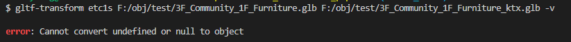

## 에러 메시지

다음과 같은 에러가 뜰 때가 있다.

etc1s라는 옵션은 ktx를 활용하여 텍스쳐를 압축시키는데, 해당 모듈의 옵션을 사용하고 싶을 때 로컬 환경에 ktx를 설치해주어야 한다.

[https://github.com/KhronosGroup/KTX-Software/releases](https://github.com/KhronosGroup/KTX-Software/releases)

`Assets` 부분 밑에 있다.

버젼에 맞춰서 설치하고, 설치할 때 PATH를 추가해주는 옵션에 체크도 해주자.

윈도우 64bit사용자라면 [여기](https://github.com/KhronosGroup/KTX-Software/releases/download/v4.0.0/KTX-Software-4.0.0-win64.exe)

근데 gltf-transform의 [가이드페이지](https://gltf-transform.donmccurdy.com/cli.html)나 깃허브 어디에도 ktx를 설치해주란 말은 없는데..ㅠ

ktx때문에 gltf-transform을 찾았기에 망정이지 gltf-transform부터 갖다 쓰려고 했으면 문제를 못찾아서 꽤나 애먹었겠다 싶었다.

이게 없어서 뜨는 에러면 이거를 설치해달라고 로그가 나오면 좋았을텐데 🤔

~~아니면 내가 찾지를 못했거나..~~
