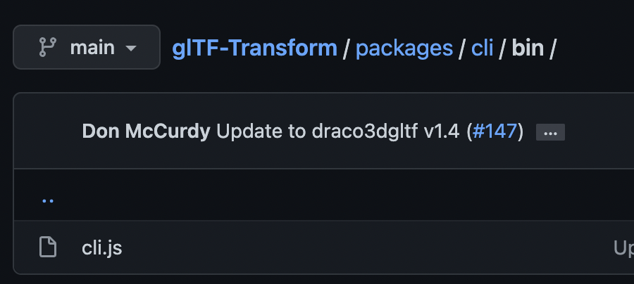

# 노드 cli모듈을 노드 모듈에서 불러 쓰기

- spawn함수를 사용하여 [gltf-transform](https://github.com/donmccurdy/glTF-Transform) 이라는 노드 모듈을 사용해야 했다.
- 비동기가 중심인 node이지만 기존의 소스코드에서 해당 모듈을 사용하려면 동기방식으로 사용해야 했기 때문에 spawn이 아닌 [spawnsync](https://nodejs.org/api/child_process.html)를 사용함.
- 보통 뒤에 `sync`가 붙으면 비동기가 아닌 동기방식이라 보면 된다 함.

노드 모듈 안에 노드 모듈을 불러다 쓸 수 있나..?? 싶었는데 된다. </br>
내가 사용하려는 gltf-transform의 경우 cli외에도 여러 편리한 함수를 제공해주었지만 그걸 활용하는 것 보다도 </br>
cli에서 명시된 기능만으로도 내가 원하는 기능을 충분히 더 간편하게 활용할 수 있을 것 같아서 최대한 cli를 쓰는 방법을 찾게 되었고 성공했다.
</br></br>
방법은 생각보다 간단(하였으나 나는 오래걸렸다.)</br>



```
npm install @gltf-transform
```

을 사용할 경우 해당 프로젝트 내 node_module에 @gltf-transform 폴더가 생길 것이다.

```javascript
let normPath = `프로젝트경로의node_module경로/@gltf-transform/cli/bin/cli.js`
spawnSync('node', [normPath, 'etc1s', exportedGlbPath, exporedKtxPath])
```

방식으로 실행시켜주면 끝!

혹시 @gltf-transform/cli에 bin이 없다면 해당 패키지를 삭제하고 다시 인스톨 해보는 것을 추천

### 근데 etc1s랑 uastc의 차이는 뭔데?

gltf-transform에서 gltf의 텍스쳐를 ktx2방식으로 압축하는데 있어서 `etc1s`와 `uastc`라는 두 가지 옵션이 존재한다. </br>
etc1s는 다소 원본보다 낮은 퀄리티와 낮은 용량, uastc는 높은 퀄리티와 높은 용량으로 텍스쳐를 압축해준다. </br>
처음에 uastc방식으로 gltf를 압축하면서 용량이 오히려 커진 것을 보고 당황했다..(compress해준다면서 용량이 왜 늘어나는건데?ㅠ) </br>
퀄리티가 다소 떨어져도 웹에 올리면서 성능을 떨어뜨릴 수 없기 때문에 etc1s방식으로 사용하게 됨.
