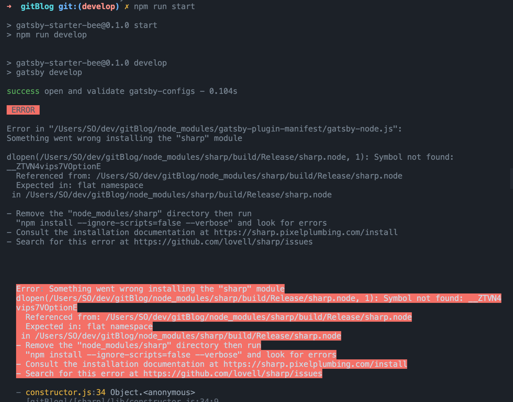

노트북을 2015 intel 맥북 프로에서 2021 M1 맥북 에어로 바꾼 후 gatsby로 된 깃 블로그를 사용하려는 과정에서 문제가 있었음.

`npm run start`를 하면 자꾸만 요딴 에러가 뜨는 것...  


### 해결책

출처 : https://stackoverflow.com/questions/54409953/cant-install-sharp

```
npm install sharp@0.23.2
```

에러가 생겼던 원인은 sharp모듈에서 아직 M1 맥북을 지원해주지 않는 탓이라고..? 근데 왜 버젼을 다운그레이드 해야 해결이 되는지 모르겠다. 아무튼 버젼을 확 낮춰주면 잃어버릴뻔한 gatsby 블로그가 아주 잘 사용이 된다.

이것 때문에 올해 초에 깃허브 블로그를 개설해놓고 사용하지 못한 문제가 있었다.. 라는 더할 나위 없는 좋은 핑계 ^~^ </br>

패러럴즈로 우분투 환경에서까지 시도해보고 정말 다양한 시도를 했다..~</br> 그래도 맥 환경에서 성공해서 너무 다행~

진짜 딱 마지막으로 시도해보고 안되면 티스토리든 벨로그든 옮겨버리겠다 생각했는데 12월이 되어서야 딱 되는 것을 보고 그래도 아직 할만한가보군 싶어 다시 글을 써보는 것으로..
