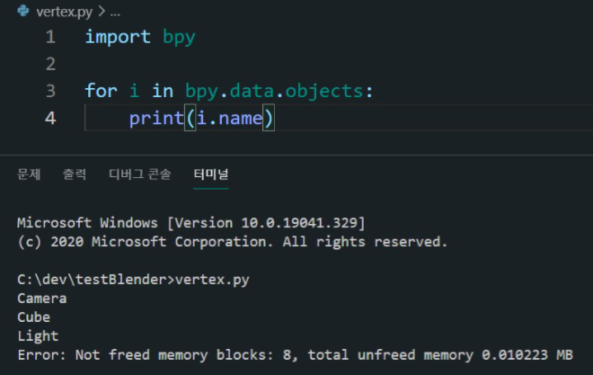
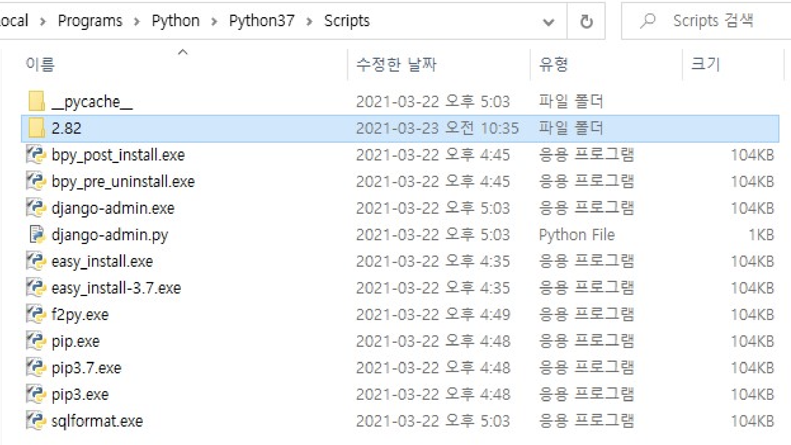
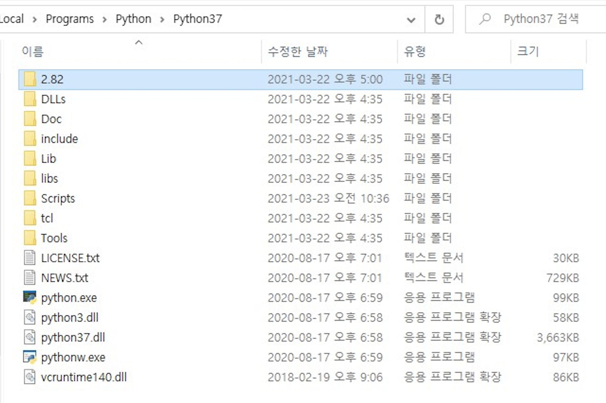

# bpy모듈 설치 후기

> bpy모듈을 설치하면서 하루종일 삽질한 후기...

`Wavefront의 .obj파일`을 병합하기 위해 `블렌더`라는 프로그램을 사용하게 되었다. </br>
`블렌더`라는 프로그램에는 파이썬 스크립트를 쓸 수 있는 기능이 있는데 여기에서 사용하는 `bpy`모듈(블렌더 파이썬)을 vsc에서도 가져다 쓰려면 bpy모듈을 설치(`pip install bpy`)해야 한다.

pip install bpy만 하면 될 줄 알았는데 되지 않던가요...? 그렇다면 가장 먼저 파이썬 버젼을 한번 살펴봅시다. </br></br>

1. 가장 중요한 것은 파이썬 버젼이 `3.7`이여야 한다. (3.6도 안되고 3.8도 안된다.)
   - 처음에 3.6으로 시도하다가 안돼서 높은 버젼으로 해야하나..? 싶어 3.8로 올려서했는데 그래도 안되길래 왜그럴까 했는데 알고보니 3.7만 쓰라고 되어 있었다...
   - bpy모듈에 대한 설명이 있는 [pypi사이트](https://pypi.org/project/bpy/2.91a0/) 에 보면 Requires에 Python버젼을 무조건 3.7로 하라고 명시되어 있다.

</br>

## 테스트를 통해 확인

중간중간에 테스트를 하려면

```
import bpy

for i in bpy.data.objects:
    print(i.name)
```

를 실행해보자. 블렌더를 켜면 가장 먼저 기본적으로 있는 세가지 객체들이 존재한다. vsc에서 bpy모듈이 정상적으로 작동한다면 기본 세가지 객체의 name값인 Camera, Cube, Light가 나온다.


</br></br>

2. `No module named 'bpy_types'` 에러 </br>
   블렌더 자체가 오픈소스라 깃허브에 이슈에 관한 내용이 등록되어 있다. ([바로여기](https://github.com/TylerGubala/blenderpy/issues/13))

이건 로컬의 파이썬이 위치한 경로에서 폴더 위치만 바꿔주면 된다. </br>
bpy를 설치하고 나면 로컬의 파이썬이 위치한 경로에 들어가보자. </br>
내 컴퓨터의 경우 파이썬이 `C:\Users\USER\AppData\Local\Programs\Python\Python37\Scripts` 에 위치해 있다. </br>
bpy모듈을 설치하고 나면 이 Scripts폴더에 숫자(아마도 사용하는 블렌더의 버젼명)가 생성되어 있다.



- 여기 있는 2.82 폴더를 상위 폴더인 Python37폴더에 옮겨준다. `복사가 아니라 옮겨야 한다.`


</br></br>

근데 2018년도에 생긴 이슈인데 왜 아직도 수정을 안한건지 통 알 수가 없다...~~도대체 왜...오픈소스인데 아무도 컨트리뷰션을 하지 않는건지...?~~ </br></br>

3. 이 밖의 No module named같은 에러가 뜬다면 `pip install 필요한모듈명` 을 써서 설치해주자.
   이때 pip 명령어가 터미널에서 먹지 않는 경우에는 파이썬의 환경변수를 잡아주어야 한다. ([참고](https://wxmin.tistory.com/121))

</br>

---

### bpy 개발 시 참고 사이트

- [blender docs](https://docs.blender.org/manual/en/latest/)
- [blender stack exchange](https://blender.stackexchange.com/)
- [blender wiki](https://wiki.blender.org/wiki/Main_Page)
